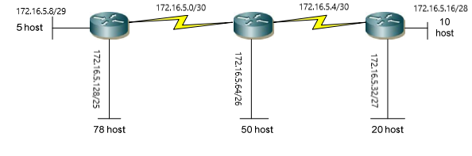

# Bài Tập
**Bài 1:** Cho mạng và số bit mượn. Giả sử có hỗ trợ subnet zero. Hãy xác định:  
+ Số subnet có thể có.
+ Số host/subnet.
+ Với mỗi subnet, hãy xác định: địa chỉ mạng, địa chỉ host đầu, địa chỉ host cuối, địa chỉ broadcast (nếu số lượng mạng quá nhiều chỉ cần ghi ra một vài mạng đầu và mạng cuối cùng), subnet mask và số prefix.  

***1***. - 192.168.2.0/24 mượn 5 bit. 

Mượn 5 bit => số bit mạng là 29  
=> số subnet có thể có = 32  
số host trên mỗi subnet = 6  
Ta có dải địa chỉ:  
192.168.2.0/29  -> Địa chỉ mạng  
192.168.2.1/29  -> Địa chỉ host đầu  
192.168.2.6/29  -> Địa chỉ host cuối  
192.168.2.7/29  -> địa chỉ broadcast

---
192.168.2.8/29  -> Địa chỉ mạng  
192.168.2.9/29  -> Địa chỉ host đầu  
192.168.2.14/29  -> Địa chỉ host cuối  
192.168.2.15/29  -> địa chỉ broadcast  

---
..........

---
192.168.2.248/29  -> Địa chỉ mạng  
192.168.2.249/29  -> Địa chỉ host đầu  
192.168.2.254/29  -> Địa chỉ host cuối  
192.168.2.255/29  -> địa chỉ broadcast  
subnet mask: 255.255.255.248  

***2***. - 192.168.12.0/24 mượn 3 bit.

Mượn 3 bit => số bit mạng là 27  
=> số subnet có thể có = 8  
số host trên mỗi subnet = 30   
Ta có dải địa chỉ:  
192.168.2.0/27  -> Địa chỉ mạng  
192.168.2.1/27  -> Địa chỉ host đầu  
192.168.2.30/27  -> Địa chỉ host cuối  
192.168.2.31/27  -> địa chỉ broadcast

---
192.168.2.32/27  -> Địa chỉ mạng  
192.168.2.33/27  -> Địa chỉ host đầu  
192.168.2.62/27  -> Địa chỉ host cuối  
192.168.2.63/27  -> địa chỉ broadcast  

---
..........

---
192.168.2.224/27  -> Địa chỉ mạng  
192.168.2.225/27  -> Địa chỉ host đầu  
192.168.2.254/27  -> Địa chỉ host cuối  
192.168.2.255/27  -> địa chỉ broadcast  
subnet mask: 255.255.255.224  

***3***. -  172.16.2.0/24 mượn 2 bit  

Mượn 2 bit => số bit mạng là 26  
=> số subnet có thể có = 4  
số host trên mỗi subnet = 60   
Ta có dải địa chỉ:  
192.168.2.0/26  -> Địa chỉ mạng  
192.168.2.1/26  -> Địa chỉ host đầu  
192.168.2.62/26  -> Địa chỉ host cuối  
192.168.2.63/26  -> địa chỉ broadcast

---
192.168.2.62/26  -> Địa chỉ mạng  
192.168.2.63/26  -> Địa chỉ host đầu  
192.168.2.126/26  -> Địa chỉ host cuối  
192.168.2.127/26  -> địa chỉ broadcast  

---
..........

---
192.168.2.196/26  -> Địa chỉ mạng  
192.168.2.197/26  -> Địa chỉ host đầu  
192.168.2.254/26  -> Địa chỉ host cuối  
192.168.2.255/26  -> địa chỉ broadcast  
subnet mask: 255.255.255.192  

***4***. - 172.16.0.0/16 mượn 3 bit  

Mượn 3 bit => số bit mạng là 19  
=> số subnet có thể có = 8  
số host trên mỗi subnet = 8190   
Ta có dải địa chỉ:  
172.16.0.0/19   -> Địa chỉ mạng  
172.16.0.1/19  -> Địa chỉ host đầu  
172.16.31.254/19  -> Địa chỉ host cuối  
172.16.31.255/19  -> địa chỉ broadcast

---
172.16.32.0/19  -> Địa chỉ mạng  
172.16.32.1/19  -> Địa chỉ host đầu  
172.16.63.254/19  -> Địa chỉ host cuối  
172.16.63.255/19  -> địa chỉ broadcast  

---
..........

---
172.16.191.0/19  -> Địa chỉ mạng  
172.16.191.1/19  -> Địa chỉ host đầu  
172.16.191.254/19  -> Địa chỉ host cuối  
172.16.191.255/19  -> địa chỉ broadcast  
subnet mask: 255.255.224.0  

***5***. - 172.16.0.0/16 mượn 12 bit.  

Mượn 12 bit => số bit mạng là 28  
=> số subnet có thể có = 4096  
số host trên mỗi subnet = 14   
Ta có dải địa chỉ:  
172.16.0.0/28   -> Địa chỉ mạng  
172.16.0.1/28  -> Địa chỉ host đầu  
172.16.0.14/28  -> Địa chỉ host cuối  
172.16.0.15/28  -> địa chỉ broadcast

---
172.16.0.16/28  -> Địa chỉ mạng  
172.16.0.17/28  -> Địa chỉ host đầu  
172.16.0.30/28  -> Địa chỉ host cuối  
172.16.0.31/28  -> địa chỉ broadcast  

---
..........

---
172.16.255.240/28  -> Địa chỉ mạng  
172.16.255.241/28  -> Địa chỉ host đầu  
172.16.255.254/28  -> Địa chỉ host cuối  
172.16.255.255/28  -> địa chỉ broadcast  
subnet mask: 255.255.255.240  

***6***. - 10.0.0.0/8 mượn 5 bit. 

Mượn 5 bit => số bit mạng là 13  
=> số subnet có thể có = 32  
số host trên mỗi subnet = 524286   
Ta có dải địa chỉ:  
10.0.0.0/13   -> Địa chỉ mạng  
10.0.0.1/13  -> Địa chỉ host đầu  
10.7.255.254/13  -> Địa chỉ host cuối  
10.7.255.255/13  -> địa chỉ broadcast

---
10.8.0.0/13  -> Địa chỉ mạng  
10.8.0.1/13  -> Địa chỉ host đầu  
10.15.255.254/13  -> Địa chỉ host cuối  
10.15.255.255/13  -> địa chỉ broadcast  

---
..........

---
10.248.0.0/13  -> Địa chỉ mạng  
10.248.0.1/13  -> Địa chỉ host đầu  
10.255.255.254/13  -> Địa chỉ host cuối  
10.255.255.255/13  -> địa chỉ broadcast  
subnet mask: 255.248.0.0  

***7***. - 10.0.0.0/8 mượn 10 bit.  

Mượn 10 bit => số bit mạng là 18  
=> số subnet có thể có = 1024  
số host trên mỗi subnet = 16382   
Ta có dải địa chỉ:  
10.0.0.0/18   -> Địa chỉ mạng  
10.0.0.1/18  -> Địa chỉ host đầu  
10.0.63.254/18  -> Địa chỉ host cuối  
10.0.63.255/18  -> địa chỉ broadcast

---
10.0.64.0/18  -> Địa chỉ mạng  
10.0.64.1/18  -> Địa chỉ host đầu  
10.0.127.254/18  -> Địa chỉ host cuối  
10.0.127.255/18  -> địa chỉ broadcast  

---
..........

---
10.255.192.0/18  -> Địa chỉ mạng  
10.255.192.1/18  -> Địa chỉ host đầu  
10.255.255.254/18  -> Địa chỉ host cuối  
10.255.255.255/18  -> địa chỉ broadcast  
subnet mask: 255.255.192.0  

***8***. -  10.0.0.0/8 mượn 18 bit.  

Mượn 18 bit => số bit mạng là 28  
=> số subnet có thể có = 262144  
số host trên mỗi subnet = 14   
Ta có dải địa chỉ:  
10.0.0.0/28   -> Địa chỉ mạng  
10.0.0.1/28  -> Địa chỉ host đầu  
10.0.0.14/28  -> Địa chỉ host cuối  
10.0.0.15/28  -> địa chỉ broadcast

---
10.0.0.0/28  -> Địa chỉ mạng  
10.0.0.1/28  -> Địa chỉ host đầu  
10.0.0.30/28  -> Địa chỉ host cuối  
10.0.0.31/28  -> địa chỉ broadcast  

---
..........

---
10.255.255.240/28  -> Địa chỉ mạng  
10.255.255.241/28  -> Địa chỉ host đầu  
10.255.255.254/28  -> Địa chỉ host cuối  
10.255.255.255/28  -> địa chỉ broadcast  
subnet mask: 255.255.255.240  

**Bài 2:** Cho mạng 172.16.5.0/24. Hãy chia nhỏ sao cho phù hợp với sơ đồ sau:  

  

ta xét số lượng host trong mạng từ cao xuống thấp theo thứ tự: 79, 51, 21, 11, 6, 2, 2.  

Bắt đầu chia: Mượn 1 bit
=> mạng 172.16.5.0/24 sẽ chia dc thành 2 mạng và mỗi mạng có 126 host.
+ 172.16.5.0/25 dùng để tiếp tục chia
+ 172.16.5.128/25 dùng cho mạng có 79 host  

Tiếp tục mượn 1 bit cho mạng 172.16.5.0/25 sẽ chia được thành 2 mạng và mỗi mạng có 62 host.  
+ 172.16.5.0/26 dùng để tiếp tục chia
+ 172.16.5.64/26 dùng cho mạng có 51 host

Tiếp tục mượn 1 bit cho mạng 172.16.5.0/26 sẽ chia được thành 2 mạng và mỗi mạng có 30 host.  
+ 172.16.5.0/27 dùng để tiếp tục chia
+ 172.16.5.32/27 dùng cho mạng có 21 host  

Tiếp tục mượn 1 bit cho mạng 172.16.5.0/27 sẽ chia được thành 2 mạng và mỗi mạng có 14 host. 
+ 172.16.5.0/28 dùng để tiếp tục chia
+ 172.168.5.16/28 dùng cho mạng có 11 host  

Tiếp tục mượn 1 bit cho mạng 172.16.5.0/28 được 2 mạng, mỗi mạng có 6 host
+ 172.168.5.0/29 dùng để chia tiếp
+ 172.168.5.8/29 dùng cho mạng 6 host

Mượn tiếp một bit cho mạng 172.168.5.0/29 ta được 2 mạng, mỗi mạng có 2 host
+ 172.168.5.0/30 dùng cho mạng có 2 host thứ nhất 
+ 172.168.5.4/30 dùng cho mạng có 2 host thứ 2. 

Ta được kết quả chia sau:  

  

**Bài 4:** Cho các địa chỉ host sau đây. Hãy xác định các địa chỉ subnet tương ứng và cho biết địa chỉ này có thể dùng đặt cho host được không:  
1) 192.168.1.130/29  
2) 172.16.34.57/18  
3) 203.162.4.191/28  
4) 1.1.1.1/30  
5) 10.10.10.89/29  
6) 70.9.12.35/30  
7) 158.16.23.208/29  

**Giải**  

1, /29 => có 29 bit mạng. Octet bị chia cắt là octet thứ 4 => só bit mượn của octet này là 5 => bước nhảy là 8. Lấy octet thứ 4 của địa chỉ host là 130 chia cho 8 được 16 và còn dư. Ta lấy 16 nhân với 8 được 128. Host này thuộc mạng 192.168.1.128/29  

2, /18 => có 18 bit mạng. Octet bị chia cắt là octet thứ 3 => só bit mượn của octet này là 2 => bước nhảy là 64. Lấy octet thứ 3 của địa chỉ host là 34 chia cho 64 được 0 và còn dư. Ta lấy 64 nhân với 0 được 0. Host này thuộc mạng 172.16.0.0/18  

3,  /28 => có 28 bit mạng. Octet bị chia cắt là octet thứ 4 => só bit mượn của octet này là 4 => bước nhảy là 16. Lấy octet thứ 4 của địa chỉ host là 191 chia cho 16 được 11 và còn dư. Ta lấy 16 nhân với 11 được 176. Host này thuộc mạng 203.162.4.176/28  

4, /30 => có 30 bit mạng. Octet bị chia cắt là octet thứ 4 => só bit mượn của octet này là 6 => bước nhảy là 4. Lấy octet thứ 4 của địa chỉ host là 1 chia cho 4 được 0 và còn dư. Ta lấy 1 nhân với 4 được 0. Host này thuộc mạng 1.1.1.0/30  

5, /29 => có 29 bit mạng. Octet bị chia cắt là octet thứ 4 => só bit mượn của octet này là 5 => bước nhảy là 8. Lấy octet thứ 4 của địa chỉ host là 89 chia cho 8 được 11 và còn dư. Ta lấy 11 nhân với 8 được 88. Host này thuộc mạng 10.10.10.88/29

6, /30 => có 30 bit mạng. Octet bị chia cắt là octet thứ 4 => só bit mượn của octet này là 6 => bước nhảy là 4. Lấy octet thứ 4 của địa chỉ host là 1 chia cho 4 được 0 và còn dư. Ta lấy 1 nhân với 4 được 0. Host này thuộc mạng 1.1.1.0/30  

7, /29 => có 29 bit mạng. Octet bị chia cắt là octet thứ 4 => só bit mượn của octet này là 5 => bước nhảy là 8. Lấy octet thứ 4 của địa chỉ host là 208 chia cho 8 được 26 và không dư => 158.16.23.208/29 là địa chỉ mạng không dùng làm host được

**Bài 3:** Hãy tóm tắt các địa chỉ mạng sau đây về thành một địa chỉ mạng đại diện:   

+  192.168.0.0/24   
 192.168.1.0/24   
 192.168.2.0/24   
 192.168.3.0/24  

Ta thấy các địa chỉ mạng trên bắt đầu khác nhau ở octet thứ 3:  
192.168.|000000|00.0  
192.168.|000000|01.0  
192.168.|000000|10.0  
192.168.|000000|11.0  
Octet thứ ba còn có thêm 6 bit giống nhau. Vậy ta có mạng tóm tắt là 192.168.0.0/22  

+ 172.16.16.0/24   
 172.16.20.0.24   
 172.16.24.0/24   
 172.16.28.0/24  

 Ta thấy các địa chỉ mạng trên bắt đầu khác nhau ở octet thứ 3:  
172.16.|000|10000.0  
172.16.|000|10100.0  
172.16.|000|11000.0  
172.16.|000|11100.0  

Octet thứ ba còn có thêm 3 bit giống nhau. Vậy ta có mạng tóm tắt là 172.16.0.0/19.

