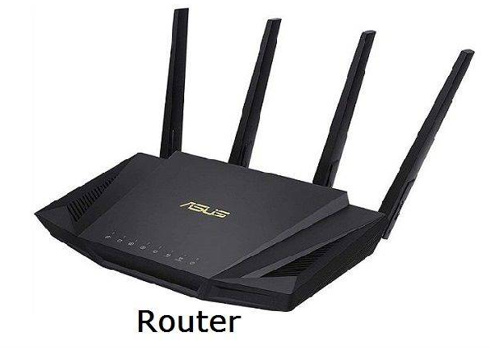
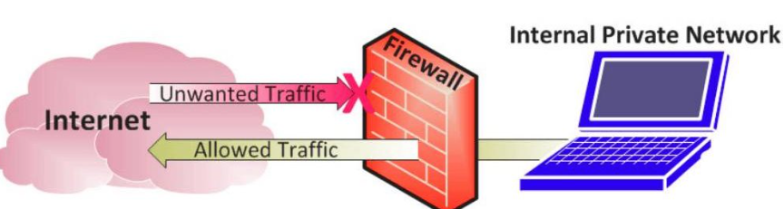
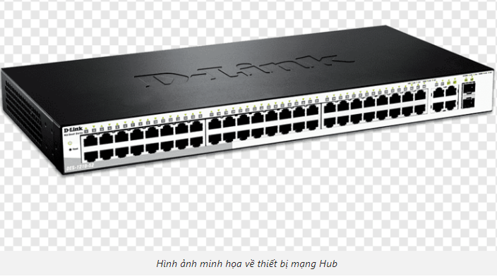
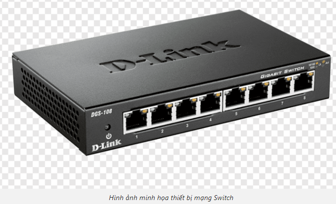

# 1. Router
Router – Bộ định tuyến là một thiết bị vật lý được sử dụng để truyền thông tin giữa các máy tính chuyển mạch gói với nhau. Nhiệm vụ của Router là kiểm tra địa chỉ IP của một gói dữ liệu và tính toán cách tốt nhất để nó đến đích, sau đó thực hiện các bước chuyển tiếp phù hợp.  

Router được triển khai dưới dạng cổng nằm ở vị trí giao nhau của các Network xuất hiện trên Internet. Có hàng trăm Router có thể chuyển tiếp một gói tin đến đích cuối trong quá trình di chuyển từ mạng này sang mạng tiếp theo.  

  

# 2. Firewall
Firewall là phần mềm hoặc chương trình cơ sở hoạt động như một bức rào chắn nhằm ngăn chặn sự truy cập trái phép vào mạng. Bằng một bộ quy tắc có sẵn nó sẽ kiểm tra lưu lượng đến và đi để xác định và chặn các mối đe dọa. Tường lửa được cài đặt cho máy tính cá nhân và doanh nghiệp, nó còn được tích hợp sẵn ở một số hệ điều hành như Mac, Windows, Linux.  

  

# 3. Hub
Hub là một trung tâm kết nối các thiết bị trong mạng lại với nhau. Khi gói dữ liệu được truyền đến một cổng của Hub, ngay lập tức các bản sao sẽ được tạo ra để chuyển tiếp tới các cổng khác. Vì Hub không có bảng định tuyến thông minh nên không thể xác định được các thông tin và phát tín hiệu kết nối trên toàn bộ các cổng. Điều này làm tăng các rủi ro về an toàn bảo mật và hiệu suất hoạt động.  

  

# 4. Switch
Switch là thiết bị thường được sử dụng trong các hệ thống mạng với vai trò dùng để kết nối và vận chuyển, trao đổi dữ liệu giữa những thiết bị trong hệ thống đó. Khác với Router có thể định tuyến dữ liệu đến nhiều mạng hay thiết bị, Switch chỉ có thể đưa dữ liệu đến 1 thiết bị được liên kết với đầu ra của nó. Thiết bị này có thể là Router, Switch khác, máy tính, laptop, điện thoại.  

  

## Switch L2, L3
+ Switch Layer 2 hay L2 có nhiệm vụ căn cứ vào địa chỉ MAC để gửi các gói tin đi  
+ Switch Layer 3 hay L3 căn cứ vào địa chỉ IP thiết bị nhận để gửi các gói tin.  

Đa số Switch đều hoạt động ở lớp thứ 2 và thường sử dụng cáp Ethernet để kết nối với hệ thống. Đây là một loại cáp vật lý được cắm trực tiếp vào các thiết bị kết nối thông qua cổng Ethernet.  

# Sự khác biệt giữa Hub, Switch và Router.
+ Trong khi Hub và Switch liên quan đến việc truyền khung dữ liệu thì Router là định tuyến các gói tin trên mạng tới đích cuối cùng.
+ Hub được gắn với 1 thành phần mạng Ethernet; Switch có thể kết nối hiệu quả nhiều thành phần mạng Ethernet; còn Router đảm nhiệm tất cả các chức năng của Hub và Switch và thêm công việc định tuyết các gói TCP/IP giữa các mạng LAN và WAN; cùng nhiều chức năng khác.

