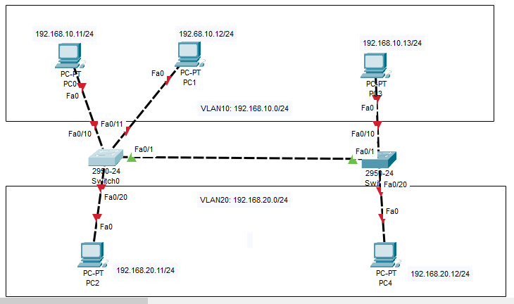
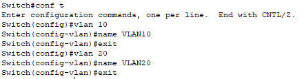
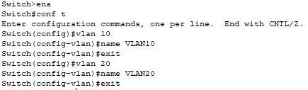
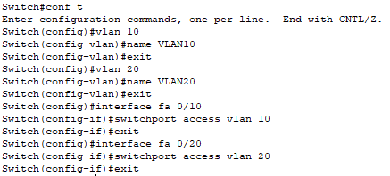
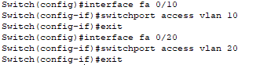
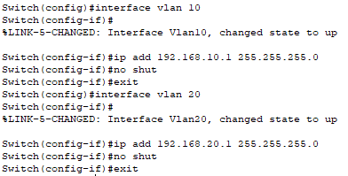
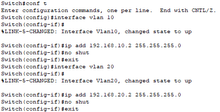
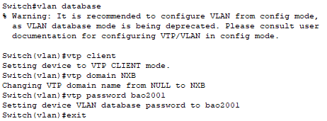
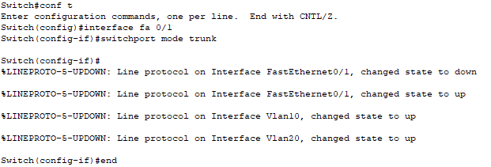
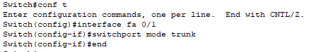

# 2. Cấu hình VTP domain
**Topo:**

  

**Quy hoạch VLAN:**  
+ VLAN 10: 192.168.10.0/24
+ VLAN 20: 192.168.20.0/24  

**Switch 0**  
+ VLAN 10:  
PC0: 192.169.10.11 Fa0/10  
PC1: 192.168.10.12 Fa0/11  
+ VLAN 20:  
PC2: 192.168.20.11 Fa0/20  

**Switch 1**  
+ VLAN 10:  
PC3: 192.168.10.13 Fa0/10
+ VLAN 20:  
PC4: 192.168.20.12 Fa0/20  

## Thiết lập VLAN trên 2 switch
**Tạo Vlan:**  
SW0:

  

SW1:

**Gán port:**  
SW0:  

  

SW1:  

  

## Đặt IP cho interface VLAN
SW0:  

  

SW1:  

  

## Thiết lập VTP server, VTP client
+ Switch 0: VTP server
+ Switch 1: VTP client
+ VTP domain: NXB
+ VTP password: bao2001

SW0:  

  

SW1:  

  

## Tạo đường Trunk từ SW0-SW1
SW0:  

  

SW1:  

  

