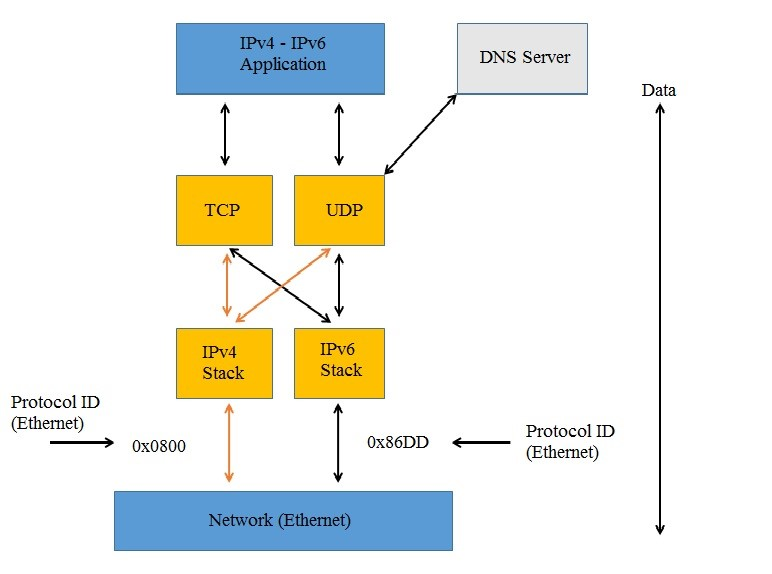

# 1. IPv6 là gì?
IPv6 là phiên bản tiếp theo của giao thức Internet Protocol (IP), mà được sử dụng để điều hướng gói tin trên mạng Internet. Nó được thiết kế để thay thế cho IPv4, giao thức hiện tại được sử dụng rộng rãi nhất trên thế giới.  
IPv6 được sử dụng để giải quyết vấn đề về hạn chế số lượng địa chỉ IP có sẵn trong IPv4. Vì IPv4 chỉ có khoảng 4,3 tỷ địa chỉ khả dụng, nên không thể đáp ứng được nhu cầu của các thiết bị mới đang liên tục được kết nối vào Internet. IPv6 cung cấp hàng tỷ lượng địa chỉ IP khổng lồ hơn, do đó có thể đáp ứng tốt hơn nhu cầu của thiết bị mới và các hệ thống không dây. 
# 2. Cấu trúc và thành phần của IPv6
## 2.1 Cấu trúc
Cấu trúc địa chỉ IPv6 gồm 8 phần, mỗi phần có độ dài là 16 bit (2 byte). Tổng cộng có 128 bit, còn nhiều hơn gấp đôi so với IPv4, có 32 bit (4 byte). Mỗi phần địa chỉ IPv6 được ngăn cách bởi dấu gạch ngang (:). Ví dụ, một địa chỉ IPv6 có thể là: 2001:0db8:85a3:0000:0000:8a2e:0370:7334.  

Địa chỉ IPv6 cũng có thể được viết dưới dạng “shorthand notation” để giảm bớt số lượng ký tự. Trong trường hợp này, các phần có giá trị là 0 sẽ bỏ qua. Ví dụ, địa chỉ IPv6 trên có thể được viết lại như sau: 2001:db8:85a3::8a2e:370:7334.  

  

## 2.2 Thành phần
Địa chỉ IPv6 có 3 thành phần:  
+ Prefix: Là phần đầu của địa chỉ IPv6, gọi là “prefix”, có thể được sử dụng để xác định một mạng lớn hơn.
+ Subnet ID: là một bộ phận có cấu trúc giống với một mạng đơn nằm bên trong web đóng vai trò thể hiện cấu trúc site của mạng. .
+ Interface identifier: Là phần còn lại của địa chỉ IPv6, định danh duy nhất cho một thiết bị trên mạng.  

  

VD: Một địa chỉ IP thuộc IPv6 như sau: 2001:0f68:0000:0000:0000:0000:1986:69af  
Trong đó:
+ Site prefix: 2001:0f68:0000
+ Subnet ID: 0000
+ Interface ID: 0000:0000:1986:69af

# 3. Phân loại
Địa chỉ IPv6 được chia thành 3 loại sau đây:  
## Unicast:
Một địa chỉ unicast xác định duy nhất 1 interface của 1 node IPv6. Một gói tin có đích đến là 1 địa chỉ unicast thì gói tin đó sẽ được chuyển đến 1 interface duy nhất có địa chỉ đó. Có các loại địa chỉ sau thuộc Unicast:  
**Global Unicast Address:** Là địa chỉ IPv6 toàn cầu (tương tự như địa chỉ public của IPv4). Phạm vi định vị của GUA là toàn hệ thống IPv6 trên thế giới.  
+ 3 bit đầu luôn có giá trị là 001 (Prefix=2000::/3)
+ Global Routing Prefix: gồm 45 bit. Là địa chỉ được cung cấp cho công ty, cơ quan, tập đoàn hay một tổ chức nào đó khi đăng ký địa chỉ IPv6 public.
+ Subnet ID: Gồm 16 bit, là địa chỉ do các tổ chức tự cấp.
+ Interface ID: Gồm 54 bit, là địa chỉ của các interface trong subnet.  

  

**Link-local Address:** Là địa chỉ được sử dụng cho những node trên 1 link duy nhất. Tự động cấu hình, tìm kiếm neighbor. Router không được chuyển tiếp gói tín có địa chỉ nguồn hoặc đích là link-local ra khỏi phạm vi liên kết. Bao gồm các địa chỉ dùng cho các host trong cùng 1 link và quy trình xác định các node (Neighbor Discovery Process), qua đó các node trong cùng link cũng có thể liên lạc với nhau. Phạm vi sử dụng của LLA là trong cùng 1 link (do đó có thể trùng nhau ở link khác). Khi dùng HĐH Windows, LLA được cấp tự động như sau:  
+ 64 bit đầu có giá trị FE80 là giá trị cố định (Prefix=FE80::/64)
+ Interface ID: gồm 64 bit kết hợp cùng địa chỉ MAC. Ví dụ: FE80::1CEF:01BC:FE01:1101  

  

**Site Local Address:** Được sử dụng trong hệ thống nội bộ (Intranet) tương tự các địa chỉ Private IPv4 (10.X.X.X, 172.16.X.X, 192.168.X.X). Phạm vi sử dụng Site-Local Addresses là trong cùng Site.  
+ 1111 1110 11: 10 bit đầu là giá trị cố định (Prefix=FEC0/10)
+ Subnet ID: gồm 54 bit dùng để xác định các subnet trong cùng site.
+ Interface ID: Gồm 64 bit là địa chỉ của các interface trong subnet. Lưu ý: Hai dạng địa chỉ Unicast (LLA và SLA) vừa trình bày trên được gọi chung là các địa chỉ unicast nội bộ (Local Use Unicast Address). Với cấu trúc như thế thì các Local Use Unicast Address có thể bị trùng lặp (trong các Link khác hoặc Site khác). Do vậy khi sử dụng các Local Use Unicast Address có 1 thông số định vị được thêm vào là Additional Identifier gọi là Zone ID.  

  

**Unique-Local Addresses:** Đối với các tổ chức có nhiều Site, Prefix của SLA có thể bị trùng lặp. Có thể thay thế SLA bằng ULA (RFC 4193), ULA là địa chỉ duy nhất của một Host trong hệ thống có nhiều Site với cấu trúc:  
+ 1111 110: 7 bit đầu là giá trị cố định FC00/7.
## Multicast:
Trong địa chỉ IPv6 không còn tồn tại khái niệm địa chỉ Broadcast. Mọi chức năng của địa chỉ Broadcast trong IPv4 được đảm nhiệm thay thế bởi địa chỉ IPv6 Multicast.  

Địa chỉ Multicast giống địa chỉ Broadcast ở chỗ điểm đích của gói tin là một nhóm các máy trong một mạng, song không phải tất cả các máy. Trong khi Broadcast gửi trực tiếp tới mọi host trong một subnet thì Multicast chỉ gửi trực tiếp cho một nhóm xác định các host, các host này lại có thể thuộc các subnet khác nhau.  

Host có thể lựa chọn có tham gia vào một nhóm Multicast cụ thể nào đó hay không (thường được thực hiện với thủ tục quản lý nhóm internet - Internet Group Management Protocol), trong khi đó với Broadcast, mọi host là thành viên của nhóm Broadcast bất kể nó có muốn hay không.  

  

  
## Anycast:
Địa chỉ Anycast được gán cho một nhóm các giao diện (thông thường là những nodes khác nhau), và những gói tin có địa chỉ này sẽ được chuyển đổi giao diện gần nhất có địa chỉ này. Khái niệm gần nhất ở đây dựa vào khoảng cách gần nhất xác định qua giao thức định tuyến sử dụng. Thay vì gửi 1 gói tin đến 1 server nào đó, nó gửi gói tin đến địa chỉ chung mà sẽ được nhận ra bởi tất cả các loại server trong loại nào đó, và nó tin vào hệ thống định tuyến để đưa gói tin đến các server gần nhất này.  

Trong giao thức IPv6, địa chỉ anycast không có cấu trúc đặc biệt. Các địa chỉ Anycast nằm trong một phần không gian của địa chỉ unicast. Do đó, về mặt cấu trúc địa chỉ Anycast không thể phân biệt với địa chỉ Unicast. Khi những địa chỉ Unicast được gán nhiều hơn cho một giao diện nó trở thành địa chỉ Anycast. Đối với những node được gán địa chỉ này phải được cấu hình với ý nghĩa của địa chỉ anycast. Trong cấu trúc của bất kỳ một địa chỉ anycast đều có một phần tiền tố P dài nhất để xác định phạm vi (vùng) mà địa chỉ anycast đó gán cho các giao diện. 

# 4. Dual Stack
Dual Stack còn gọi là cơ chế chồng giao thức, là cơ chế cơ bản nhất cho phép nút mạng đồng thời hỗ trợ cả hai giao thức Ipv4 và Ipv6. Có được khả năng trên do một trạm Dual Stack cài đặt cả hai giao thức Ipv6 và Ipv4. Trạm Dual Stack sẽ giao tiếp bằng giao thức Ipv4 với các trạm Ipv4 và bằng giao thức Ipv6 với các trạm Ipv6.

  

## So sánh Dual Stack và cài IPv6 riêng biệt
**Cài đặt bài hát IPv6 với IPv4 (IPv4/IPv6 Dual-stack):**

+ Trong quá trình cài đặt này, mạng sử dụng cả song song IPv4 và IPv6. Các thiết bị và dịch vụ trên mạng có thể sử dụng cả hai phiên bản của giao thức Internet này.
+ Điều này cho phép các thiết bị và ứng dụng tiếp tục sử dụng IPv4 trong khi IPv6 được hỗ trợ cho các ứng dụng và dịch vụ mới hoặc đã được nâng cấp.
+ IPv6 và IPv4 được phát triển cùng nhau và các thiết bị trong mạng sẽ có cả địa chỉ IPv6 và IPv4.

**Cài đặt IPv6 riêng biệt (chỉ dành cho IPv6):**

+ Trong quá trình cài đặt này, mạng chỉ sử dụng IPv6 mà không sử dụng IPv4. Điều này có nghĩa là tất cả các thiết bị và dịch vụ trên mạng sẽ sử dụng IPv6 để giao tiếp.
+ Điều này thường được thực hiện trong môi trường môi trường mới, sạch sẽ, không phụ thuộc vào IPv4 và có khả năng phát triển đầy đủ IPv6.
+ Yêu cầu đảm bảo rằng tất cả các ứng dụng và thiết bị trên mạng đều hỗ trợ IPv6.

Tóm lại, sự khác biệt chính giữa việc cài đặt IPv6 riêng biệt và cài đặt song song IPv6 với IPv4 là về việc sử dụng IPv4. Đặc biệt, trong quá trình cài đặt IPv6 riêng, IPv4 không được sử dụng, trong khi cài đặt song song IPv6 với IPv4, cả hai phiên bản của giao thức Internet này đều được sử dụng và hỗ trợ. Lựa chọn cài đặt nào phụ thuộc vào công cụ yêu cầu của mạng và khả năng khai thác IPv6 của bạn.

***Tài liệu tham khảo***  
[viblo.asia](https://viblo.asia/p/tim-hieu-ve-ipv6-3P0lPyDG5ox)  
[vnpro.vn](https://vnpro.vn/thu-vien/co-che-dual-stack-va-duong-ham-ipv6-qua-ipv4-2273.html)
