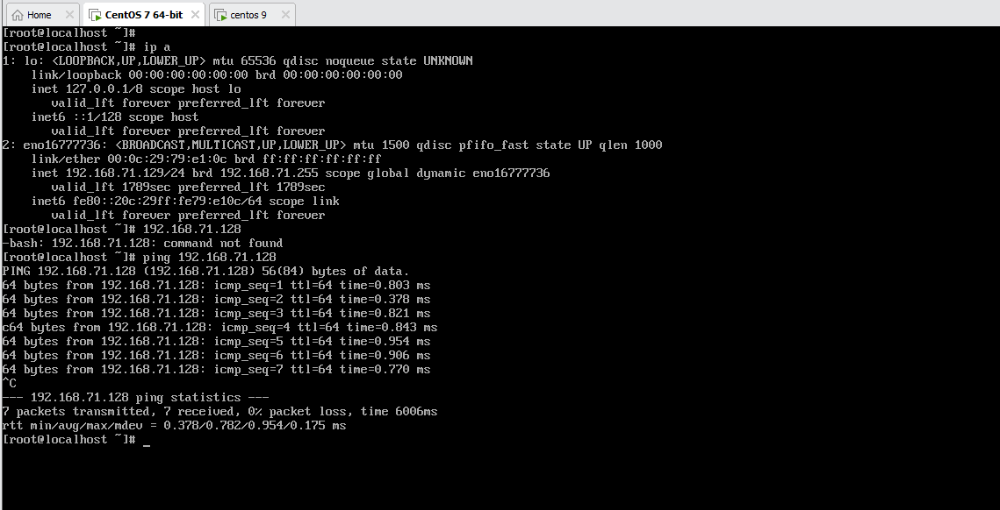

# Phân biệt 3 chế độ mạng
## 1. NAT
**Chế độ NAT:** ở chế độ này, card mạng của máy ảo kết nối với VMnet8, VNnet8 cho phép máy ảo đi ra mạng vật lý bên ngoài internet thông qua cơ chế NAT (NAT device). Lúc này lớp mạng bên trong máy ảo khác hoàn toàn với lớp mạng của card vật lý bên ngoài, hai mạng hoàn toàn tách biệt. IP của card mạng máy ảo sẽ được cấp bởi DHCP của VMnet8, trong trường hợp bạn muốn thiết lập IP tĩnh cho card mạng máy ảo bạn phải đảm bảo chung lớp mạng với VNnet8 thì máy ảo mới có thể đi internet.

  

+ Ping từ máy ảo ra internet bằng chế độ NAT.  

## 2. Bridge
**Chế độ Bridge:** ở chế độ này, card mạng trên máy ảo được gắn vào VMnet0, VMnet0 này liên kết trực tiếp với card mạng vật lý trên máy thật, máy ảo lúc này sẽ kết nối internet thông qua  card mạng vật lý và có chung lớp mạng với card mạng vật lý.

+ Ping từ máy ảo ra lap cá nhân bằng chế bộ Bridge.  
  

## 3. Host-only
**Cơ chế Host-only:**  máy ảo được kết nối với VMnet có tính năng Host-only, trong trường hợp này là VMnet1 . VMnet Host-only kết nối với  một card mạng ảo tương ứng ngoài máy thật (như đã nói ở phần trên). Ở chế độ này,  các máy ảo không có kết nối vào mạng vật lý bên ngoài hay internet thông qua máy thật , có nghĩa là mạng VMnet Host-only và mạng vật lý hoàn toàn tách biệt. IP của máy ảo được cấp bởi DHCP của VMnet tương ứng. Trong nhiều trường hợp đặc biệt cần cấu hình riêng, ta có thể tắt DHCP trên VMnet và cấu hình IP bằng tay cho máy ảo.

  

+ Ping từ Centos 7 sang Centos 9 bằng host-only.  

Tài liệu tham khảo:  
[engisv.info](https://www.engisv.info/?p=134)