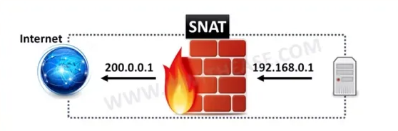
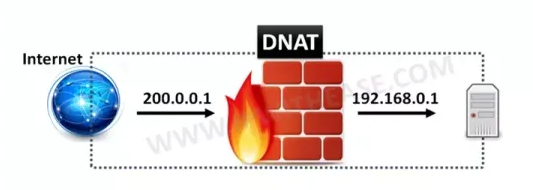

# SNAT là gì?
SNAT là viết tắt của Source Network Address Translation (Dịch địa chỉ mạng nguồn). Nó thường được sử dụng khi máy chủ nội bộ/riêng tư cần bắt đầu kết nối với máy chủ bên ngoài/công cộng. Thiết bị thực hiện NAT thay đổi địa chỉ IP riêng của máy chủ nguồn thành địa chỉ IP công cộng. Nó cũng có thể thay đổi cổng nguồn trong tiêu đề TCP/UDP.  
Một tình huống điển hình thường sử dụng SNAT là khi được yêu cầu thay đổi địa chỉ hoặc cổng riêng tư thành địa chỉ hoặc cổng công cộng khi các gói rời khỏi mạng. Về thứ tự hoạt động trên thiết bị NAT, tính năng SNAT xuất hiện sau khi quyết định định tuyến được đưa ra. Hơn nữa, khi có nhiều máy chủ trên mạng “bên trong” muốn truy cập vào bất kỳ máy chủ nào trên mạng “bên ngoài”, SNAT sẽ được sử dụng.  

  
# DNAT là gì?
DNAT là viết tắt của Destination Network Address Translation (Dịch địa chỉ mạng đích). NAT đích thay đổi địa chỉ đích trong tiêu đề IP của gói. Nó cũng có thể thay đổi cổng đích trong tiêu đề TCP / UDP . Cách sử dụng thông thường của việc này là chuyển hướng các gói đến có đích là địa chỉ/cổng công cộng sang địa chỉ/cổng IP riêng trong mạng của bạn.  
NAT đích được thực hiện trên các gói đến, trong đó tường lửa  chuyển địa chỉ đích công khai sang địa chỉ riêng. DNAT là bản dịch tĩnh 1-1 với tùy chọn thực hiện chuyển tiếp cổng hoặc dịch cổng.  

Người dùng qua Internet Truy cập Máy chủ Web được lưu trữ trong Trung tâm Dữ liệu là một ví dụ điển hình trong đó DNAT được sử dụng để ẩn Địa chỉ riêng của Máy chủ Web và thiết bị NAT chuyển IP đích công cộng có thể truy cập được cho Người dùng Internet thành địa chỉ IP riêng của Máy chủ Web . 

