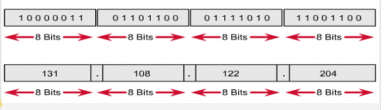
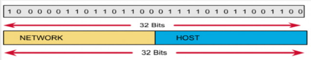
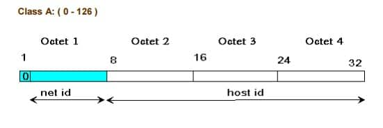
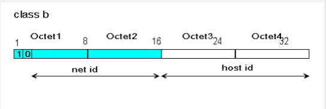
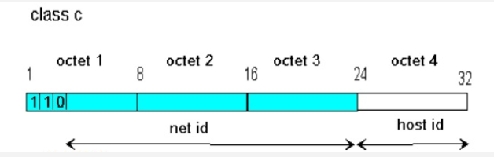

# 1. IPv4 là gì?  
**IPv4** (Internet Protocol version 4): Đây là một giao thức Internet phiên bản thứ 4 trong sự phát triển của các giao thức Internet (IP). Nó phụ trách thiết lập các kết nối Logic giữa các thiết bị mạng  
  

IPv4 được ứng dụng trong các hệ thống chuyển mạch gói. Vai trò của nó là định hướng dữ liệu truyền đi.
# 2. Tại sao lại không có IPv1,v2,v3,v5 ?  
**IPv1:** IPv1 là phiên bản đầu tiên của giao thức Internet Protocol (IP), được mô tả trong RFC 791 vào năm 1981. Tuy nhiên, nó chưa được triển khai rộng rãi do nhiều vấn đề kỹ thuật và thiếu các tính năng quan trọng mà các phiên bản sau này mới đảm nhận.  

**IPv2 và IPv3:** IPv2 và IPv3 cũng đã được đề xuất, nhưng chúng chưa bao giờ được công nhận chính thức và không bao giờ được triển khai rộng rãi. Có thể do các vấn đề kỹ thuật hoặc khả năng của chúng không phù hợp với yêu cầu của mạng ngày nay.  

**IPv5:** Giao thức thử nghiệm IPv5 cũng đã tồn tại, nhưng nó không bao gồm các cải tiến đáng kể và cuối cùng đã không được phát triển tiếp. IPv5 thường được liên kết với giao thức Internet Stream Protocol (ST), một giao thức chạy trên lớp thứ tư của mô hình TCP/IP. Giao thức ST sau này đã được phát triển thành Real-time Transport Protocol (RTP), mà ngày nay được sử dụng rộng rãi để truyền tải âm thanh và video trực tuyến.  

Như vậy, không có một lý do duy nhất để giải thích tại sao không có IPv1, IPv2, IPv3 và IPv5 trong việc sử dụng thực tế. Đôi khi, các phiên bản mới không phát triển do các vấn đề kỹ thuật, thiếu tính năng, hoặc bởi vì có các phiên bản khác tốt hơn đáp ứng tốt hơn cho nhu cầu mạng ngày nay.
# 3.Cấu trúc và thành phần của IPv4
**Cấu trúc:** một địa chỉ IPv4 sẽ gồm 4 con số ở dạng thập phân tượng trưng cho 4 cụm. Mỗi cụm như vậy sẽ gọi là octet. Mỗi [octet](https://bkhost.vn/blog/octet/) sẽ là 8 bit và chúng được ngăn cách bằng dấu chấm (.)  

  

**Thành phần:** Gồm 2 phần là phần mạng và phần host.  

  

Quy tắc đặt địa chỉ IP:  
+ Không được đặt những bit ở phần network bằng 0 cùng một lúc. Khi đặt tất cả những bit ở phần network bằng không thì địa chỉ IP sẽ có 3 số đầu là 0.0.0. Đây là một địa chỉ sai.  
+ Nếu đặt tất cả các bit ở phần host bằng 0 thì số cuối cùng của địa chỉ IP sẽ bằng 0. Khi đó địa chỉ đó là một địa chỉ mạng, không thể dùng làm host. Ví dụ: 191.168.10.0 là một địa chỉ mạng.  
+ Nếu đặt tất cả các bit ở phần host là 1 thì số cuối cùng của địa chỉ IP là 255. Khi đó địa chỉ này sẽ là một địa chỉ [broadcast](https://bkhost.vn/blog/dia-chi-broadcast/) của mạng đó. Ví dụ: 192.168.10.255 là một địa chỉ broadcast.
# 4. Các lớp của IPv4
Dựa vào cách chọn địa chỉ mạng mà địa chỉ IP được phân thành 5 lớp A, B, C, D, E. Đặc điểm của các lớp như sau:  
**Lớp A**  

  

+ Địa chỉ lớp A có phần mạng là 8 bit đầu và phần host là 24 bit sau. Bit đầu tiên của phần mạng luôn là 0.  
+ Lớp A sẽ có các địa chỉ mạng từ 1.0.0.0 đến 126.0.0.0 và mỗi mạng sẽ có 224 địa chỉ host (loại trừ địa chỉ mạng và địa chỉ broadcast).  
+ Mạng [loopback](https://bkhost.vn/blog/loopback/) sẽ là 127.0.0.0  

**Lớp B**

  

+ Địa chỉ lớp B có phần mạng là 16 bit đầu và phần host là 16 bit sau. 2 bit đầu tiên của phần mạng luôn là 1.0.
+ Lớp B sẽ có các địa chỉ mạng từ 128.0.0.0 đến 191.255.0.0 và mỗi mạng sẽ có 214 địa chỉ host (loại trừ địa chỉ mạng và địa chỉ broadcast).

**Lớp C**

  

+ Địa chỉ lớp C có phần mạng là 24 bit đầu và phần host là 8 bit sau. 3 bit đầu tiên của phần mạng luôn là 1.1.0.
+ Lớp C sẽ có các địa chỉ mạng từ 192.0.0.0 đến 223.255.255.0 và mỗi mạng sẽ có 26 địa chỉ host (loại trừ địa chỉ mạng và địa chỉ broadcast).  

**Lớp D**
+ Các địa chỉ trong lớp D là những địa chỉ [multicast](https://bkhost.vn/blog/multicast/) bao gồm 224.0.0.0 đến 239.255.255.255.  

**Lớp E**
+ Các địa chỉ trong lớp E có vai trò dùng để dự phòng, bao gồm những địa chỉ từ 240.0.0.0 trở đi.  

**Chú ý:** Các host chỉ có thể sử dụng địa chỉ IP trong 3 lớp A, B, C. Để biết địa chỉ nằm trong lớp nào, ta sẽ xem số đầu tiên trong địa chỉ IP để biết dựa vào các khoảng sau:
+ Lớp A từ 1 đến 126.
+ Lớp B từ 128 đến 191.
+ Lớp C từ 192 đến 223.
+ Lớp D từ 224 đến 239.
+ Lớp E từ 240 đến 255.
# 5. Phân biệt IP public và private
+ Public: là địa ch ỉ IP s ử dụng cho các gói tin đi trên môi tr ường Internet,
được định tuyến trên môi trường Internet, không sử dụng trong mạng LAN.
Địa chỉ public phải là duy nhất cho mỗi host tham gia vào Internet.  
+ Private: chỉ được sử dụng trong mạng nội bộ (mạng LAN), không được định tuyến trên môi trường Internet. Có thể được sử dụng lặp đi lặp lại trong các mạng LAN khác nhau.  

Dải địa chỉ private (được quy định trong RFC 1918):  
Lớp A: 10.x.x.x  
Lớp B: 172.16.x.x -> 172.31.x.x  
Lớp C: 192.168.x.x  

Ý nghĩa của địa chỉ private: được sử dụng để bảo tồn địa chỉ IP public đang dần cạn kiệt.  

**Tài liệu tham khảo**  
[bkhost.vn](https://bkhost.vn/blog/ipv4/)