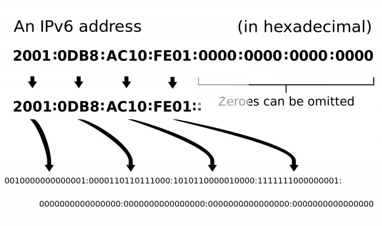
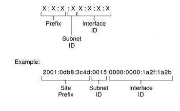

# 1. IPv6 là gì?
IPv6 là phiên bản tiếp theo của giao thức Internet Protocol (IP), mà được sử dụng để điều hướng gói tin trên mạng Internet. Nó được thiết kế để thay thế cho IPv4, giao thức hiện tại được sử dụng rộng rãi nhất trên thế giới.  
# 2. Cấu trúc thành phần của IPv6
## 2.1 Cấu trúc
Cấu trúc địa chỉ IPv6 gồm 8 phần, mỗi phần có độ dài là 16 bit (2 byte). Tổng cộng có 128 bit, còn nhiều hơn gấp đôi so với IPv4, có 32 bit (4 byte). Mỗi phần địa chỉ IPv6 được ngăn cách bởi dấu gạch ngang (:). Ví dụ, một địa chỉ IPv6 có thể là: 2001:0db8:85a3:0000:0000:8a2e:0370:7334.  

Địa chỉ IPv6 cũng có thể được viết dưới dạng “shorthand notation” để giảm bớt số lượng ký tự. Trong trường hợp này, các phần có giá trị là 0 sẽ bỏ qua. Ví dụ, địa chỉ IPv6 trên có thể được viết lại như sau: 2001:db8:85a3::8a2e:370:7334.  

  

## 2.2 Thành phần
Địa chỉ IPv6 có 3 thành phần:  
+ Prefix: Là phần đầu của địa chỉ IPv6, gọi là “prefix”, có thể được sử dụng để xác định một mạng lớn hơn.
+ Subnet ID: là một bộ phận có cấu trúc giống với một mạng đơn nằm bên trong web đóng vai trò thể hiện cấu trúc site của mạng. .
+ Interface identifier: Là phần còn lại của địa chỉ IPv6, định danh duy nhất cho một thiết bị trên mạng.  

  

VD: Một địa chỉ IP thuộc IPv6 như sau: 2001:0f68:0000:0000:0000:0000:1986:69af  
Trong đó:
+ Site prefix: 2001:0f68:0000
+ Subnet ID: 0000
+ Interface ID: 0000:0000:1986:69af

#3. Phân loại
Địa chỉ IPv6 được chia thành 3 loại sau đây:  
## Unicast:
Địa chỉ Unicast là loại địa chỉ IPv6 được sử dụng trong một mạng nội bộ (private network). Địa chỉ local unicast không được phân bố trên toàn cầu và chỉ có thể được sử dụng trong mạng cụ thể đó.  
## Multicast:
Địa chỉ Multicast là loại địa chỉ IPv6 được sử dụng để gửi tin tới nhiều thiết bị cùng một lúc. Địa chỉ multicast được dạng bắt đầu bằng FF.  
## Anycast:
Địa chỉ Anycast là loại địa chỉ IPv6 được sử dụng để gửi tin tới một thiết bị duy nhất trong một nhóm các thiết bị. Địa chỉ anycast không có dạng cụ thể cụ thể nhất định, vì nó là một địa chỉ đặc biệt được sử dụng trong một nhóm các thiết bị.
