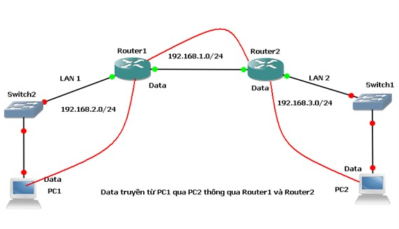
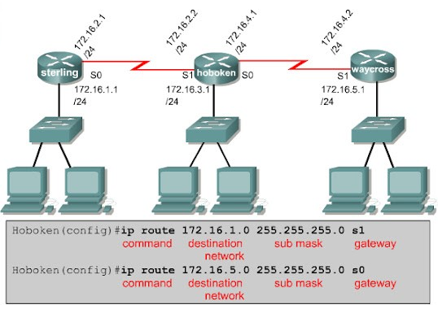
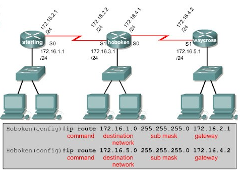

# 1. Thế nào là Routing ?
Định tuyến (Routing) là quá trình tìm kiếm và xác định đường đi tốt nhất trên một mạng máy tính để gói tin tới được đích thông qua các thiết bị định tuyến.  
Định tuyến hay routing là quá trình lựa chọn đường đi trong bất kỳ mạng nào. Một mạng máy tính được tạo thành từ nhiều máy, được gọi là các node, và các đường dẫn hoặc đường đi kết nối các node đó. Giao tiếp giữa hai node trong một mạng có thể thông qua nhiều con đường khác nhau.  

  

# 2. Static Route
Static Routing là phương thức định tuyến mà người quản trị sẽ nhập tất cả thông tin về đường đi cho router. Vậy khi cấu trúc hệ thống mạng có bất kỳ sự thay đổi nào thì người quản trị sẽ thay đổi bằng cách xóa hay thêm các thông tin về đường đi cho router, nói cách khác đường đi này là cố định. 

Nguyên lý hoạt động của Static Routing ta có thể hiểu như thế này.
+ Đầu tiên người quản trị sẽ cấu hình các đường cố định cho router
+ Sau đó, router sẽ cài đặt đường đi này vào bảng định tuyến.
+ Và gói dữ liệu được định tuyến theo đường cố định.  

Đường đi cố định có 3 cách:  
+ Cổng ra  

  

+ IP cổng kế cận  

+ Default Route: xét về câu lệnh cấu hình cũng tương tự như 2 dạng trên chỉ có khác một điều là không cần biết địa chỉ đích và Subnet Mask.  

## Ưu điểm
+ Cấu hình dễ dàng và nhanh chóng
+ Hỗ trợ ở tất cả các thiết bị định tuyến và router
+ Thường được sử dụng ở các hệ thống mạng doanh nghiệp nhỏ, ít có sự thay đổi về cấu trúc, người quản trị toàn quyền kiểm soát điều khiển bảng định tuyến và có thể giảm bớt băng thông trong hệ thống.  

## Nhược điểm
+ Độ phức tạp của cấu hình sẽ tăng khi kích thước hệ thống mạng tăng
+ Không thích hợp với những hệ thống mạng lớn vì không thể thích ứng được với sự thay đổi của hệ thống mạng
+ Khả năng cập nhật đường đi bị hạn chế đôi lúc là không thể, bởi vậy mà nguy cơ tràn băng thông là rất cao.  

***Tài liệu tham khảo***  
[vnpro.vn(1)](https://vnpro.vn/thu-vien/the-nao-la-routing-2042.html)  
[vnpro.vn(2)](https://vnpro.vn/thu-vien/static-route-la-gi-2045.html)  
[websitehcm.com](https://websitehcm.com/routing-la-gi-cac-loai-routing/)  

 
