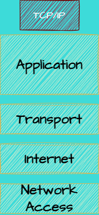
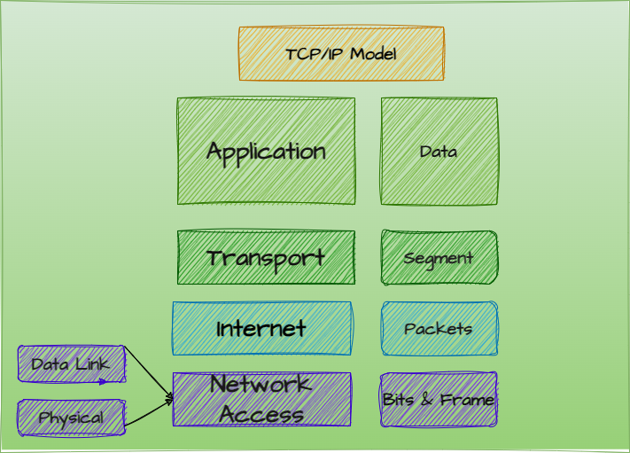

# 1. Mô hình TCP/IP là gì?
## 1.1 Khái niệm
TCP/ IP (Transmission Control Protocol/ Internet Protocol - Giao thức điều khiển truyền nhận/ Giao thức liên mạng), là một bộ giao thức trao đổi thông tin được sử dụng để truyền tải và kết nối các thiết bị trong mạng Internet.

## 1.2 Nguyễn lý hoạt động  
Trong giao thức TCP/IP, IP đóng góp một vai trò cực kỳ quan trọng. Như tên gọi đã nói lên tất cả, TCP/TP là sự kết hợp giữa 2 giao thức. IP cho phép máy tính chuyển tiếp gói tin tới một máy tính khác. Thông qua một hoặc nhiều khoảng (chuyển tiếp) gần với người nhận gói tin. Còn TCP sẽ kiểm tra các gói dữ liệu xem có lỗi không sau đó gửi yêu cầu truyền lại nếu tìm thấy lỗi.  

Có thể hình dung việc truyền tin trên Internet tựa như một dây chuyền sản xuất. Các công nhân sẽ lần lượt chuyền các bán thành phẩm qua những giai đoạn khác nhau để bổ sung hoàn thiện sản phẩm. Khi đó, IP giống như là quy cách hoạt động của nhà máy, còn TCP lại đóng vai trò là một người giám sát dây chuyền, đảm bảo cho dây chuyền liên tục nếu có lỗi xảy ra. 
# 2. Vai trò và chức năng các tầng của TCP/IP
Một mô hình TCP/IP tiêu chuẩn bao gồm 4 lớp được chồng lên nhau, bắt đầu từ tầng thấp nhất là Tầng vật lý (do physical và data link gộp lại còn được gọi là tầng network access) → Tầng mạng (Network) → Tầng giao vận (Transport) và cuối cùng là Tầng ứng dụng (Application).
## Tầng 1 - Tầng truy cập (Network Access)
Là sự kết hợp giữa tầng Vật lý và tầng liên kết dữ liệu của mô hình OSI. Chịu trách nhiệm truyền dữ liệu giữa hai thiết bị trong cùng một mạng. Tại đây, các gói dữ liệu được đóng vào khung (gọi là Frame) và được định tuyến đi đến đích đã được chỉ định ban đầu.  

## Tầng 2 - Tầng mạng (Internet)
Gần giống như tầng mạng của mô hình OSI. Tại đây, nó cũng được định nghĩa là một giao thức chịu trách nhiệm truyền tải dữ liệu một cách logic trong mạng. Các phân đoạn dữ liệu sẽ được đóng gói (Packets) với kích thước mỗi gói phù hợp với mạng chuyển mạch mà nó dùng để truyền dữ liệu. Lúc này, các gói tin được chèn thêm phần Header chứa thông tin của tầng mạng và tiếp tục được chuyển đến tầng tiếp theo. Các giao thức chính trong tầng là IP, ICMP và ARP.
## Tầng 3 - Tầng giao vận (Transport)
Chức năng chính của tầng 3 là xử lý vấn đề giao tiếp giữa các máy chủ trong cùng một mạng hoặc khác mạng được kết nối với nhau thông qua bộ định tuyến.

Đây là lớp điều khiển giao tiếp máy chủ tới máy chủ, còn được gọi là Tầng giao vận.

Tầng  truyền tải sẽ phụ trách luồng dữ liệu giữa 2 trạm thực hiện các ứng dụng của lớp trên. Tầng này có 2 giao thức chính là:

**TCP – Transmission Control Protocol:** cung cấp luồng dữ liệu tin cậy giữa 2 trạm nhờ nhiều cơ chế.

Ví dụ như chia nhỏ các gói tin ở tầng trên thành các gói tin có kích thước thích hợp cho tầng mạng bên dưới, báo nhận gói tin, đặt hạn chế thời gian timeout để đảm bảo bên nhận biết được các gói tin đã gửi đi.

**UDP – User Datagram Protocol:** gửi dữ liệu từ trạm này tới trạm kia mà không đảm bảo các gói tin đến được tới đích.
## Tầng 4 - Tầng ứng dụng (Application)
Tầng ứng dụng hay còn được gọi là Application. Đây là tầng trên cùng, có chức năng giao tiếp của mô hình. Cụ thể, tầng ứng dụng sẽ giao tiếp dữ liệu giữa 2 máy khác nhau. Việc giao tiếp có thể thông qua trình duyệt web, email hay một số giao thức khác như SMTP, SSH, FTP…   

Tầng ứng dụng giao thức dữ liệu bằng hình thức Byte by Byte. Các thông tin sẽ được định tuyến với nhau, giúp gói tin đi theo một hướng đi đúng và thông tin được truyền tải thành công. 
# 3. Workflow với mô hình TCP/IP
Các bước gửi dữ liệu của giao thức TCP/IP:  
**Bước 1:** Phân đoạn dữ liệu: Trước khi gửi dữ liệu, TCP chia nó thành các phân đoạn nhỏ hơn, mỗi phân đoạn có kích thước tối đa là MSS (Maximum Segment Size).  
**Bước 2:** Thiết lập kết nối: Trước khi truyền dữ liệu, hai máy tính cần thiết lập một kết nối TCP thông qua quá trình bắt tay ba bước (three-way handshake). Quá trình này bao gồm việc gửi tin nhắn SYN, SYN-ACK và ACK để xác nhận kết nối.  
**Bước 3:** Truyền dữ liệu: Sau khi kết nối đã được thiết lập, dữ liệu sẽ được truyền từ máy tính nguồn đến máy tính đích thông qua các gói tin TCP. Mỗi gói tin đi kèm với một số thứ tự để đảm bảo dữ liệu được gửi và nhận đúng thứ tự.  
**Bước 4:** Xác nhận và kiểm tra lỗi: Sau khi một gói tin được nhận, máy tính đích sẽ gửi một ACK (acknowledgment) trở lại máy tính nguồn để xác nhận việc nhận dữ liệu. Nếu máy tính nguồn không nhận được ACK trong thời gian định trước, nó sẽ gửi lại gói tin đó.  
**Bước 5:** Đóng kết nối: Khi quá trình truyền dữ liệu hoàn tất, hai máy tính cần đóng kết nối bằng cách gửi tin nhắn FIN và ACK. Quá trình này được gọi là four-way handshake.
# 4. So sánh mô hình TCP/IP và OSI
## Giống nhau  
+ Cùng sử dụng kỹ thuật chuyển Packet  
+ Đều có lớp Network và lớp Transport  
+ Đều có kiến trúc phân lớp, vì chúng đều được xây dựng dựa trên các lớp, nói cách khác là đều phân tầng như nhau.  
+ Đều đơn giản hóa quá trình khắc phục sự cố bằng cách chia nhỏ chức năng phức tạp thành các phần giản đơn.  
  
## Khác nhau  
|**Nội dung**|**Mô hình OSI**|**Mô hình TCP/IP**|  
|------------|---------------|------------------|
|Độ tin cậy và phổ biến|Nhiều người cho rằng đây là mô hình cũ, chỉ để tham khảo, số người sử dụng hạn chế hơn so với TCP/IP|Được chuẩn hóa, nhiều người tin cậy và sử dụng phổ biến trên toàn cầu|  
|Sự kết hợp giữa các tầng|Mỗi tầng khác nhau sẽ thực hiện một nhiệm vụ khác nhau, không có sự kết hợp giữa bất cứ tầng nào|Trong tầng ứng dụng có tầng trình diễn và tầng phiên được kết hợp với nhau|
|Thiết kế|Phát triển mô hình trước sau đó sẽ phát triển giao thức|Các giao thức được thiết kế trước sau đó phát triển mô hình|
|Số lớp (Tầng)|7|4| 
|Truyền thông|Hỗ trợ cả kết nối định tuyến và không dây|Hỗ trợ truyền thông không kết nối từ tầng mạng| 
|Tính phụ thuộc|Giao thức độc lập|Phụ thuộc vào giao thức|  

  

**Tài liệu tham khảo:**  
[totolink.vn](https://www.totolink.vn/article/149-mo-hinh-tcp-ip-la-gi-chuc-nang-cua-cac-tang-trong-mo-hinh-tcp-ip.html)  
[tenten.vn](https://tenten.vn/tin-tuc/tcp-ip-la-gi/#31_Tang_1_8211_Tang_Vat_ly_Physical)  
[xaydungso.vn](https://xaydungso.vn/blog/tim-hieu-giao-thuc-tcpip-la-gi-va-cac-ung-dung-thuc-tien-vi-cb.html#0)  
[fpttelecom.com](https://fpttelecom.com/blog/mo-hinh-osi/)