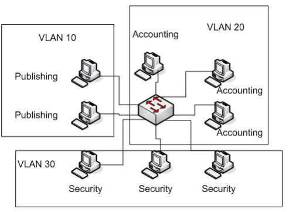
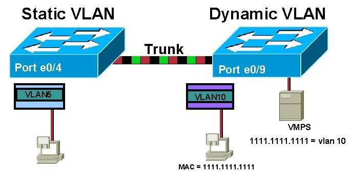

# 1. VLAN là gì?
Trước khi tìm hiểu về VLAN, cần hiểu về mạng LAN.  
[Mạng cục bộ LAN](https://bkhost.vn/blog/mang-lan/) (viết tắt của Local Area Network) là một nhóm các máy tính hoặc các thiết bị ở trong một khu vực (trường học, tòa nhà) cùng chia sẻ một mạng vật lý. 
 
VLAN là viết tắt của Virtual Local Area Network hay còn gọi là mạng LAN ảo. Mạng LAN ảo (VLAN) là một nhóm các máy tính được kết nối với cùng một mạng nhưng không ở gần nhau. Sử dụng VLAN cho phép sử dụng tài nguyên mạng hiệu quả hơn và có thể hữu ích khi có quá nhiều thiết bị cho một mạng.  

Một VLAN được định nghĩa là một nhóm logic các thiết bị mạng và được thiết lập dựa trên các yếu tố như chức năng, bộ phận, ứng dụng… của công ty. Về mặt kỹ thuật, VLAN là một miền quảng bá được tạo bởi các switch. Bình thường thì router đóng vai trò tạo ra miền quảng bá. Đối với VLAN, switch có thể tạo ra miền quảng bá.  

Việc này được thực hiện khi bạn - quản trị viên - đặt một số cổng switch trong VLAN ngoại trừ VLAN 1 - VLAN mặc định. Tất cả các cổng trong một mạng VLAN đơn đều thuộc một miền quảng bá duy nhất.

Vì các switch có thể giao tiếp với nhau nên một số cổng trên switch A có thể nằm trong VLAN 10 và một số cổng trên switch B cũng có thể trong VLAN 10. Các bản tin quảng bá giữa những máy tính này sẽ không bị lộ trên các cổng thuộc bất kỳ VLAN nào ngoại trừ VLAN 10. Tuy nhiên, tất cả các máy tính này đều có thể giao tiếp với nhau vì chúng thuộc cùng một VLAN. Nếu không được cấu hình bổ sung, chúng sẽ không thể giao tiếp với các máy tính khác nằm ngoài VLAN này.  

Dãy giá trị VLAN-ID chạy từ 0 – 4095:  
+ 1 – 1001 : dải VLAN thường được sử dụng.  
+ 1002 – 1005 : dải này dùng để giao tiếp với các kiểu mạng LAN khác.  
+ 1006 – 4094: dải VLAN mở rộng, sử dụng khi switch hoạt động ở mode Transparent.  
+ 0 và 4095: VLAN dành riêng.  
+ VLAN 1, 1002 – 1005: mặc định trên Switch và không thể xóa được. Mặc định VLAN sau khi được tạo sẻ được lưu vào file vlan.dat trong bộ nhớ Flash.
## 2. Phân loại VLAN  

## Static VLAN (VLAN tĩnh)  
Static VLAN được tạo ra bằng cách cách gán các cổng của mỗi Switch thành một mạng VLAN. Mỗi cổng nằm trên một VLAN và chỉ giao tiếp, kết nối với những VLAN được chỉ định. Trong nhiều trường hợp các VLAN tĩnh có thể thay đổi nhanh chóng bằng thủ công hoặc tự động hóa mạng.  
## Dynamic VLAN (VLAN động)  
Khác với Static VLAN, Dynamic VLAN được tạo ra dựa trên loại lưu lượng hoặc thiết bị tạo ra lưu lượng. Thông thường kỹ sư mạng sẽ dùng phần mềm điển hình cisco work 2000 để tạo ra Dynamic VLAN. Một cổng có thể gán cho một VLAN dựa trên địa chỉ Mac nguồn của loại thiết bị đính kèm.  
# 3. Cách VLAN hoạt động 
Một VLAN được xác định trên các switch bằng một ID VLAN. Mỗi cổng trên một switch sẽ được gán cho một hoặc nhiều VLAN ID, trường hợp không được chỉ định thì nó sẽ được chuyển tới một VLAN mặc định. Mỗi VLAN sẽ cung cấp quyền truy cập dữ liệu cho tất cả những thiết bị kết nối với cổng trên switch phù hợp với VLAN ID của nó.  

ID VLAN sẽ được dịch sang thẻ VLAN bằng một thẻ 12 bit xác định tối đa 4.096 VLAN trên mỗi miền chuyển mạch. IEEE sẽ chịu trách nhiệm gắn thẻ VLAN theo tiêu chuẩn 802.1Q. Switch sẽ thêm thẻ VLAN cho khung Ethernet. Với Static VLAN, switch sẽ chèn thẻ được liên kết với ID VLAN của cổng nhập. Riêng Dynamic VLAN, switch sẽ chèn thẻ được liên kết với ID của thiết bị đó hoặc loại lưu lượng mà nó tạo ra.

Các khung Ethernet được gắn thẻ sẽ chuyển tiếp về địa chỉ MAC đích của chúng (chỉ chuyển tiếp đến các cổng có liên kết VLAN). Lưu lượng quảng bá (broadcast), unicast, multicast đều được chuyển tiếp đến các cổng trong VLAN.  
Đường trung kế kết nối (Truck) giữa các switch nhận biết được VLAN nào trải dài trên switch. Truck còn đóng vai trò truyền lưu lượng truy cập cho các VLAN được sử dụng ở hai phía đầu, cuối của nó. Khi một khung chạm đến switch đích thì thẻ VLAN sẽ bị xóa trước khi khung được truyền tới máy tính đích.

Spanning Tree Protocol (STP) là một giao thức được dùng để ngăn chặn sự lặp vòng giữa các switch trong mỗi miền lớp 2 (Ethernet). Mỗi VLAN sẽ chạy một STP riêng biệt, không phụ thuộc lẫn nhau. Nếu cấu trúc liên kết giữa nhiều VLAN giống nhau thì có thể chạy STP đa trường hợp để giảm chi phí STP.  

***Tài liệu tham khảo***  
[bkhost.vn](https://bkhost.vn/blog/vlan/)  
[quantrimang.com](https://quantrimang.com/cong-nghe/vlan-la-gi-lam-the-nao-de-cau-hinh-mot-vlan-tren-switch-cisco-64830)  
[itforvn.com](https://itforvn.com/bai-6-vlan-trunking-vtp/)
