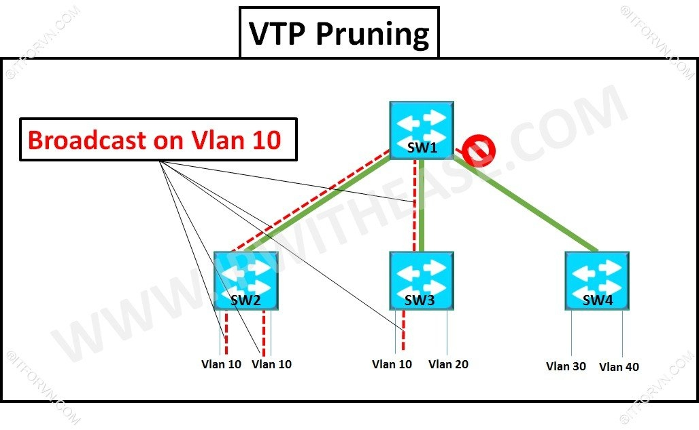

# 1. VTP và cách thức đồng bộ thông tin VLAN trong một hệ thống  
Giao thức đồng bộ thông tin VLAN giữa các thiết bị Switch của Cisco. Khi một hệ thống lớn thì việc tạo, xóa, sửa VLAN trong các Switch trở nên cực kì khó khăn. Thiếu tính chính xác và mất nhiều thời gian. Cisco đưa ra giao thức VTP tiến hành đồng bộ thông tin và cấu hình VLAN giữa các Switch trong cùng một miền Domain.  

Các đặc điểm và cách thức hoạt động của VTP:  
+ VTP hoạt động trên các đường Trunking Layer 2 để trao đổi thông tin VLAN với nhau.
+ 3 yếu tố quan trọng của VTP là : VTP domain, VTP password, VTP mode(Server, Client, Transparent). Trong đó VTP domain : các switch được tổ chức cùng thuộc một domain mới có thể chia sẻ thông tin VLAN với nhau. Được thiết lập tĩnh trên các Switch.  
# 2. VTP mode và đặc điểm các mode.  
+ Server : switch hoạt động ở mode này có toàn quyền quyết định tạo, xóa, sửa thông tin VLAN. Đồng bộ thông tin VLAN từ các Switch khác, Forward thông tin VLAN đến các Switch khác.
+ Client: switch hoạt động ở mode này không được thay đổi thông tin VLAN mà chỉ nhận thông tin VLAN từ Server. Đồng bộ thông tin VLAN từ switch khác và forward thông tin VLAN.
+ Transparent: switch hoạt động ở mode này không tiến hành tiếp nhận thông tin VLAN. Nó vẫn nhận được thông tin VLAN từ các Switch khác nhưng không tiến hành đồng bộ thông tin VLAN. Có thể tạo, xóa, sửa VLAN độc lập trên nó. Không gửi thông tin VLAN của bản thân cho các Switch khác nhưng nó có thể forward thông tin VLAN nhận được đến các Switch khác.  

# 3. Thông số Revision number.
Thông số đặc trưng trong các switch chạy VTP. Mặc định số Revision giữa các Switch đều bằng 0. Cứ mỗi lần Switch thực hiện một hành động tạo, xóa sửa VLAN nó sẻ tăng lên 1 đơn vị. Số Revision phản ảnh độ mới của thông tin VLAN.
Nếu 2 Switch được kết nối và trunking với nhau và cùng thông số VTP thì Switch có số Revision cao hơn sẻ đè cấu hình lên Switch có Revision number thấp hơn.  
# 4. VTP Prunning.
Tính năng hữu ích trong hoạt động trao đổi thông tin giữa các Switch trong mạng chuyển mạch.  

  
  
 Giả sử Host thuộc VLAN 10 tiến hành gửi một Frame đến Host khác cũng thuộc VLAN 10 nhưng nằm trong một Switch khác. Vì mỗi VLAN là một broadcast domain nên frame này sẻ được chuyển đến tất các các host thuộc VLAN 10 của Switch 2. Mặc định trên đường trunk sẽ cho qua dữ liệu của tất cả VLAN nên SW4 cũng nhận được frame này. Khi mà nó không tồn tại VLAN 10 nên việc forward frame đến SW4 gây lãng phí tài nguyên và băng thông hệ thống.
Khi được bật tính năng VTP Prunning. SW4 sẻ gửi thông điệp báo cho SW1 rằng nó không cần dữ liệu của VLAN 10(vì không tồn  tại VLAN10). Và khi SW1 khi nhận được frame broadcast này sẻ tiến hành chặn frame này không forward nó qua đường trunk đến các SW không tồn tại VLAN 10(SW4).