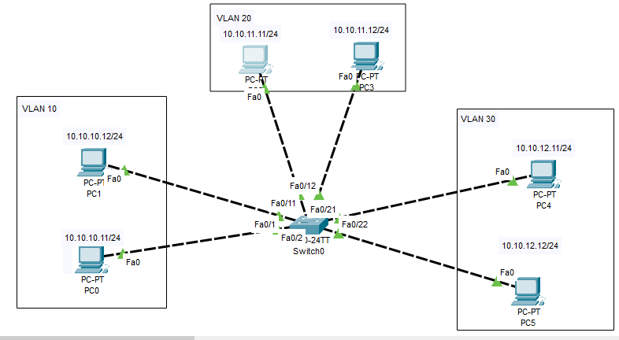
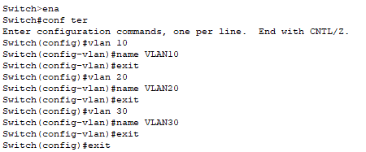
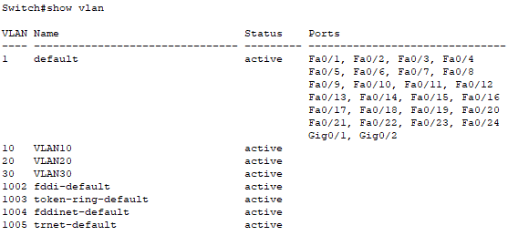
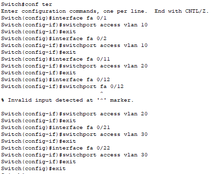
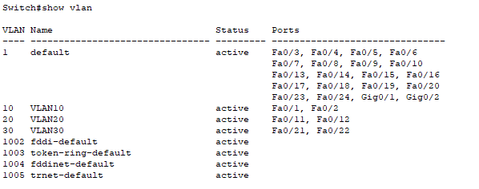

# 1. Cấu hình VLAN
**Topo mạng:**

  

|VLAN|Port|
|----|----|
|VLAN10|Fa0/1, Fa0/2|
|VLAN20|Fa0/11, Fa0/12|
|VLAN30|Fa0/21, Fa0/22|  

**Tạo VLAN 10, 20, 30**

  

**Kiểm tra VLAN vừa tạo**

  

**Gán port vào VLAN**

  

**Kiểm tra các port**

  

