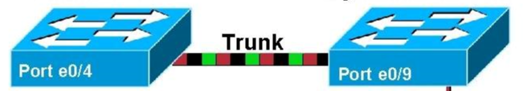
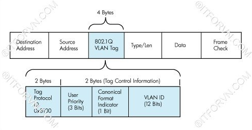
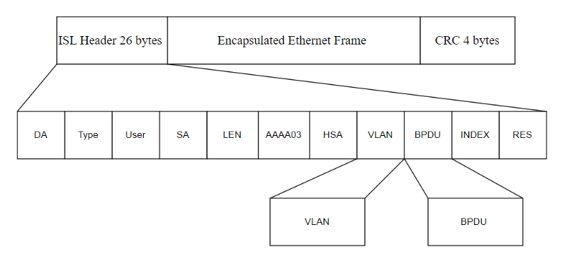

# 1. Khái niệm Trunking

  

Các Host cùng một VLAN trên 2 hoặc nhiều Switch muốn đi đến nhau thì giữa các Switch này phải có một hoặc nhiều đường đấu nối với nhau. Giả sử hệ thống bạn có quá nhiều VLAN. Giữa các VLAN trên các Switch có quá nhiều đường đấu nối là không hợp lý. Nên cần có một giải pháp chỉ cần một đường kết nối mà vẫn đảm bảo tính thông suốt của các VLAN. Đường đấu nối này gọi là đường trunk. Lúc này Switch chỉ cần dành ra một đường kết nối để thông suốt các VLAN trên các Switch lại với nhau.  
# 2. Các chuẩn Trunking trong một hệ thống mạng.
Nhìn chung kỹ thuật trunking chèn thêm thông tin vào Ethernet frame. Khi nó đi trên đường trunk để biết frame này đến từ VLAN nào để đẩy frame đến VLAN nhận một cách đúng nhất.  
## 2.1 Chuẩn IEEE và kỹ thuật trunking DOT1Q.
Kỹ thuật trunking DOT1Q thực hiện chèn thêm 4 byte vào sau trường Source MAC của Ethernet Frame trên đường trunk. Thông tin chèn này được gọi là DOT1Q Tag.  

  

Kỹ thuật trunking IEEE 802.1Q (DOT1Q) Các trường trong 802.1Q VLAN Tag bao gồm:

+ Tag Protocol ID (16 bit) nôi dung trường này luôn được set 0x8100 dùng để định danh ra frame này đã đc tag 802.1q để phân biệt với frame untagged trên đường trunk.
+ User Priority (3 bit) sử dụng cho kỹ thuật QoS.
+ Canonical Format Indicator (1bit) cho biết địa chỉ MAC đang được sử dụng ở định dạng Token Ring hay Ethernet Frame.
+ VLAN ID(12bit): cho biết Frame đang chạy trên đường trunk là của VLAN nào.

Cách thức xử lý Frame:  

Khi switch nhận được Frame có tag thông tin 802.1Q, nó sẻ tiến hành đọc thông tin này, xem frame này đến từ VLAN nào. Sau đó nó sẻ xử lí gở bỏ Tag trả lại frame đúng VLAN mà frame thuộc về. Thực chất Tag DOT1Q chỉ được tag trên đường trunk để phân biệt các frame của các VLAN khác nhau. Các End users không nhận biết được rằng frame được Tag và chuyển trên đường trunk. Trunking hoàn toàn transparent với các thiết bị đầu cuối này  
## 2.2 Chuẩn Cisco và kỹ thuật trunking ISL.
Kỹ thuật Trunking này của Cisco tiến hành chèn thêm Header 26 byte và trường CRC kiểm tra lỗi 4 byte vào Ethernet Frame.  

  

Các trường trong môt ISL Tag bao gồm:

+ DA(Destination Address): 40 bit sẻ set ở dạng 0x01-00-0C-00-00″ or “0x03-00-0c-00-00”. Để báo hiệu bên nhận rằng frame được tag ở dạng ISL.
+ Type: 4bit chỉ ra type frame được và sử dụng là gì (0000:Ethernet, 0001: Token ring….).
+ User: 4bit chỉ ra độ ưu tiên của frame khi đi qua switch(XX00: normal priority, XX01: priority 1, XX10: priority 2, XX11: highest priority).
+ SA(Source Address): 48 bit địa chỉ nguồn của gói tin ISL. Tuy nhiên thiết bị nhận có thể bỏ qua địa chỉ này
+ LEN(Length): 16bit cho biết kích thước của gói tin thực tế.
+ AAAA03 là một giá trị 24bit liên tục của  0xAAAA03.
+ HSA(High Bits of Source Address):24 bit trường này chứa giá trị “0x00-00-0C.
+ BPDU: được set để tất cả gói tin BPDU được tag ISL(hoạt động trên STP).
+ INDEX: 16bit chỉ ra chỉ số port nguồn của gói tin tồn tại trên Switch.
+ RES: dài 16bit sử dụng khi Token ring hoặc FDDI được đóng gói frame ISL, với frame Ethernet trường RES được set tất cả bit 0.  

Chuẩn trunking này là chuẩn độc quyền của Cisco và chỉ chạy trên thiết bị Cisco. Hoạt động đóng Tag trên đường trunk và mở tag ISL cũng hoạt động giống như 802.1Q encapsulation.
